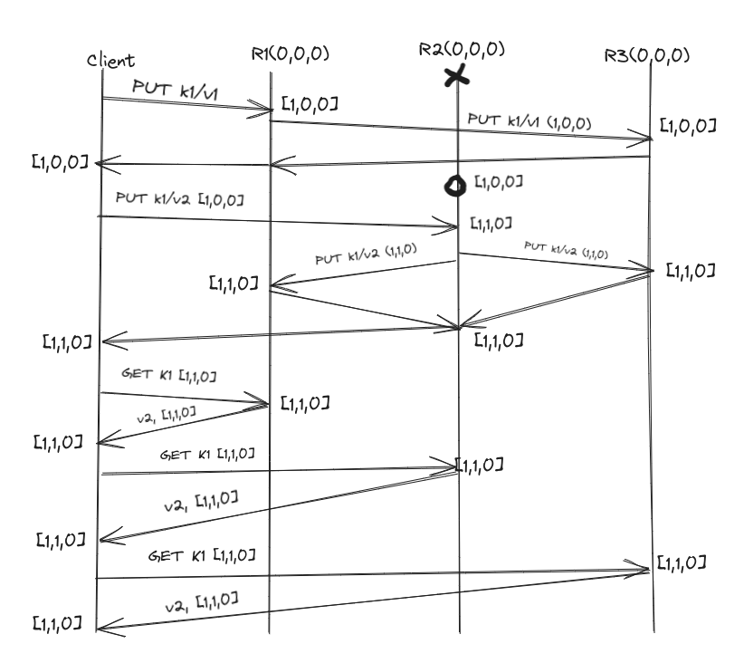

# Keynetic

Keynetic a distributed key-value store that is partition-tolerant, available, and causally consistent. In other words, in the event of a partition, key-value store is expected to be available, while still providing some consistency–specifically causal consistency.

## Mechanism

- ### Working:

    Every node in the server will be initlize it's own view, replicas and shard and virtual map upon creation. Each server is equal to each other in its role as a replica and shard. For all key value requests (PUT, GET, DELETE) the recieving node will map the key to a shard by hashing it. If it belongs to another shard we will forward the request to a node in that shard. But if the key maps to it's own shard, then the node will build an entry for the action (delete or put) and the node will broadcast the entry and the requests causal context to each replica inside of the shard. If any of the broadcasts fail due to a partition or timeout then we will store the key:entry pair and return it to the client, otherwise there is no need for causal context.

- ### View Operation 
    Views are used to keep track to the nodes in the server. 
    - The nodes send a dummy request to each node in the view. The nodes that do not respond or error out    are deleted from the view and considered dead. A request is then broadcasted to all other nodes to    delete the dead instance from their view
    - The above logic is largerly used for key PUT and DELETE operations. After getting a PUT and DELETE op the request is forwarded to other replicas.If one of those broadcasts fails, that means the server being broadcasted to is down and we will then broadcast a view delete to all other replicas in the view list.
    - One false negative that could happen in this model is the case of one of the broadcastee instances responds and then fails post-request. The request to check if the replica was alive would have succeeded, but the replica would have died immediately after.
    
- ### Causal Consistency
    Vector clocks between the client and replicas. Vector clocks are stored as a `map[string]int` with the keys being the replica server addresses, and the values being the corresponding vector clock values for each replica. Since vector clocks are passed back from replicas to clients, who then send them back to other replicas in new requests, if a replica determines that their vector clock is not updated, which is likely because the replica instance was disconnected from the others, it will GET request all other replicas for their updated key-value store values and updated vector clock(s). Additionally, vector clock values are only incremented by the replicas (by 1) when a replica receives a PUT or DELETE request from a client. At this point, the replica will broadcast the request to other replicas with the updated vector clock as casual metadata, causing them to update their vector clocks to match the one sent in the broadcast. The graph below explains the process 
    
    

- ### Consistent Hashing 
    - Hash function takes the sum of a bytearray of the utf-8 encoding of the given key. It then takes the modulo of this value with the number of shards, to get a value between 0 and (numShards-1). Then add 1 to this number, as the shardIDs begin at 1, rather than 0
    - This hashing function is consistent accross all nodes because instead of using a built-in hashing function that uses a random seed for each separate program, the sum of the bytearray is a consistent number that will yield the same result no matter which node does the calculating.

- ### Sharding 
    - Try to divide views evenly into shards. If there is an odd number of shards, add an extra view to the last shard.
    - In order to do this, first check the number of noodes in the view divided by the specified shard count. if there are enough nodes to split into shards such that there are at least 2 nodes in each shard, then proceed to split them up.
    - Split the nodes up by iterating through the list of nodes in the view n times where n is the number of nodes in the view. every floor(shardcount / 2) iterations, increment the shardID that are assigning the views to and zero out number of nodes in the shard so far. Because we use the floor division, this will always divide evenly an even number of nodes, and if there is an odd number, the last node will get added to the last shard, as an extra.
    - If the shard count was not specified, then simply dont worry about the shard hashmap until later, when the PUT request endpoint for /add-member is called. It is at this time when the node gets the updated shard hashmap, keyvaluestore, and vectorclock from the other members of the same shard.
    -If the command to start the server specifies a number of shards that is incompatible with the number of elements in the view, i.e. there is not at least 2 nodes per 1 shard, the program will display an error to the user and exit without booting the server. This same logic will result in a 404 error if sent to the /reshard endpoint
    - Each server has their own shard view that is stored in a struct with shardID, shardCount and a map of shardId to list of nodes addresses in that shard
    - Shard IDs are integers, starting from 1 and going to the number of shards (inclusive)

- ### Resharding
    - Upon reaching the reshard endpoint, first confirm that there are enough replicas to reshard to the requested number of shards.
    - Collect all keys and values from the key/value stores of each replica into the replica upon which the request was called.
    - Using the new shard amount, locally determine which shard each replica should not belong in.
    - Using the new shard values, redistribute each key/value into the shard it should now belong in using consitent hash function, and broadcast these newly organized key/value stores to each shard. The new key/value stores will override the existing ones upon the replicas receiving the broadcast.
    - The /broadcast-reshard-shard endpoint is a helper endpoint that accepts the shards dictionary from the node that sends it, and updates the shards dictionary on the recieving node.
    - The /broadcast-reshard-store endpoint is a helper endpoint that accepts the kvstore dictionary from the node that sends it, and updates the shards dictionary on the recieving node. The kvstore dictionary that is sent will only contain the key values that should be on the shard via the hashing function.

## Running instruction
    
Dockerfile can be used to run multiple servers. Following command can be executed to run the nodes:

`docker network create --subnet=10.10.0.0/16 keynetic-net`

`docker run --rm --publish 8082:8085 --net=keynetic-net --ip=10.10.0.2 --name=node1 -e SOCKET_ADDRESS=10.10.0.2:8085 -e VIEW=10.10.0.2:8085,10.10.0.3:8085,10.10.0.4:8085,10.10.0.5:8085,10.10.0.6:8085,10.10.0.7:8085 -e SHARD_COUNT=2 keynetic-img`

`docker run --rm --publish 8083:8085 --net=keynetic-net --ip=10.10.0.3 --name=node2 -e SOCKET_ADDRESS=10.10.0.3:8085 -e VIEW=10.10.0.2:8085,10.10.0.3:8085,10.10.0.4:8085,10.10.0.5:8085,10.10.0.6:8085,10.10.0.7:8085 -e SHARD_COUNT=2 keynetic-img`

`docker run --rm --publish 8084:8085 --net=keynetic-net --ip=10.10.0.4 --name=node3 -e SOCKET_ADDRESS=10.10.0.4:8085 -e VIEW=10.10.0.2:8085,10.10.0.3:8085,10.10.0.4:8085,10.10.0.5:8085,10.10.0.6:8085,10.10.0.7:8085 -e SHARD_COUNT=2 keynetic-img`

`docker run --rm --publish 8086:8085 --net=keynetic-net --ip=10.10.0.5 --name=node4 -e SOCKET_ADDRESS=10.10.0.5:8085 -e VIEW=10.10.0.2:8085,10.10.0.3:8085,10.10.0.4:8085,10.10.0.5:8085,10.10.0.6:8085,10.10.0.7:8085 -e SHARD_COUNT=2 keynetic-img`

`docker run --rm --publish 8087:8085 --net=keynetic-net --ip=10.10.0.6 --name=node5 -e SOCKET_ADDRESS=10.10.0.6:8085 -e VIEW=10.10.0.2:8085,10.10.0.3:8085,10.10.0.4:8085,10.10.0.5:8085,10.10.0.6:8085,10.10.0.7:8085 -e SHARD_COUNT=2 keynetic-img`

`docker run --rm --publish 8088:8085 --net=keynetic-net --ip=10.10.0.7 --name=node6 -e SOCKET_ADDRESS=10.10.0.7:8085 -e VIEW=10.10.0.2:8085,10.10.0.3:8085,10.10.0.4:8085,10.10.0.5:8085,10.10.0.6:8085,10.10.0.7:8085 -e SHARD_COUNT=2 keynetic-img`

This will create a network with 6 nodes that can be used to test out all the functionalitites.

## Tech

- [Golang] - Language used for development
- [Gin] - Web framework
- [Docker] - Used for conatarization
- [Python] - Used to write test scripts
